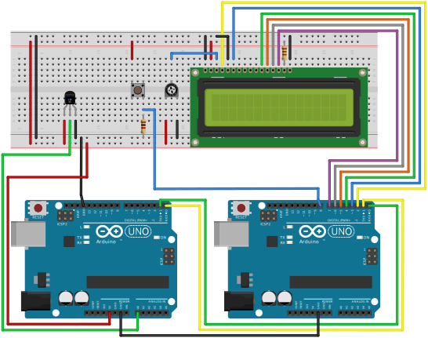
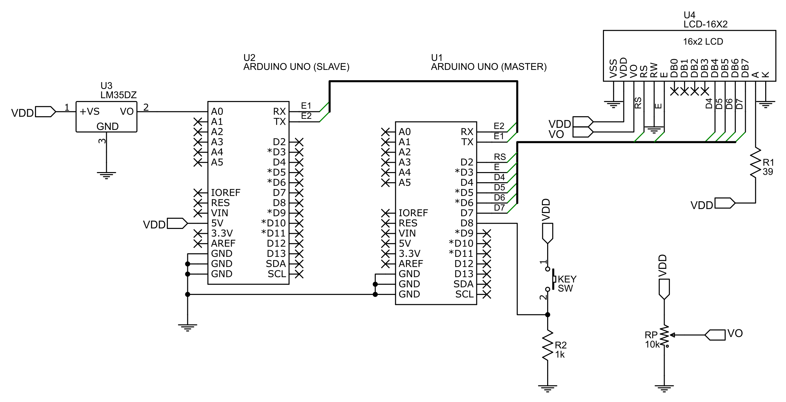

<h3 align="center">thermoarduino</h3>

  

    A simple thermometer that uses two Arduino UNO boards and an LM35 temperature
sensor.
     

<!-- TABLE OF CONTENTS -->

  
Table of Contents

  <ol>
    <li>
      <a href="#about-the-project">About The Project</a>
    <li>
      <a href="#license">License</a>
    <li>
      <a href="#contact">Contact</a>
    </li>
  </ol>

<!-- ABOUT THE PROJECT -->
## About The Project

The purpose of the following project is to create a system made up of two Arduino UNO boards in order to measure the external temperature in an environment through a sensor and to show it on an LCD.

A specific task has been assigned to the two boards, called "master" and "slave":

MASTER -  manages user input, sends specific command through the serial line to the other board to request the temperature from the sensor, shows temperature on LCD.
         
SLAVE -   receives command sent from the "MASTER" board, reads value of temperature sensor and sends it back to the other board.

Further images of the assembled circuit and of its schematic are shown below:

  
<!-- LICENSE -->
## License

Distributed under the MIT License. See `LICENSE.txt` for more information.

(<a href="#top">back to top</a>)

<!-- CONTACT -->
## Contact

"Nico" - ncant04@aol.com

Project Link: [https://github.com/ncant04/thermoarduino.git](https://github.com/ncant04/thermoarduino.git)

(<a href="#top">back to top</a>)

